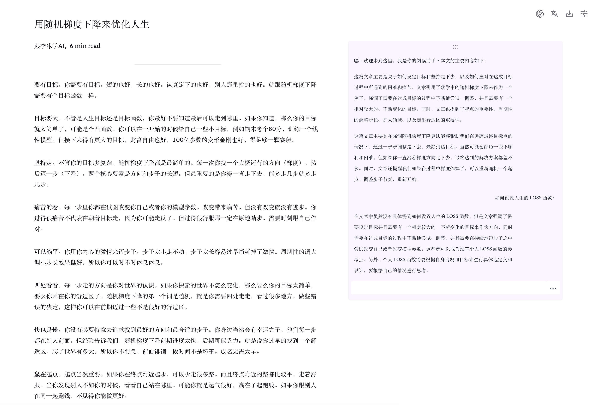
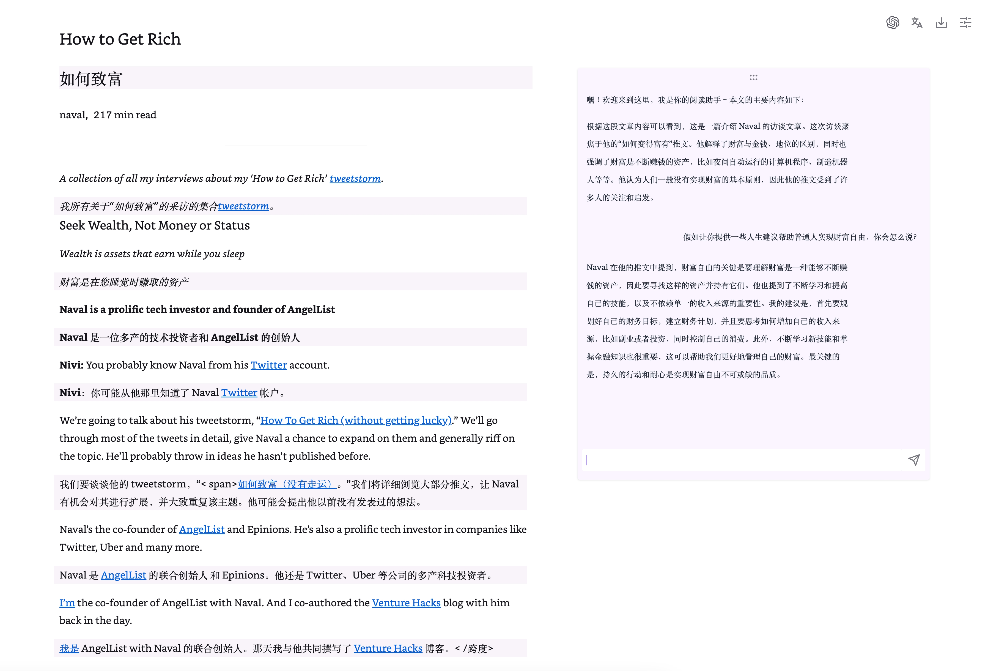

# 读点东西 - 让阅读这件事简单一点点

**读点东西**是一个类似于 Safari 阅读模式的工具，它提供了一系列的阅读功能，以增强你的阅读体验。以下是它的一些主要功能：

## 功能

### 阅读模式

在这个模式中，你可以调整字体样式、行间距和页面宽度等参数，以便享受更舒适的阅读体验。

### Chat 文章

我们的 Chat 文章功能可以生成文章的文字总结，并且还提供交互式问答环节，以增强你的理解和吸收。

### 翻译

我们支持谷歌翻译、腾讯翻译和 OpenAI 翻译。这些翻译工具让你能够轻松阅读全球的资讯。

### 下载 Markdown 格式

我们的这个功能使你可以方便地将文章以 Markdown 格式保存到本地，方便你随时查看。

## Demo

### 中文阅读

### 英文阅读，开启翻译

## 安装

- [Chrome 浏览器](https://chrome.google.com/webstore/detail/read-something/bcagnbmncmeliaknnhmbkkgackfipoic)

## 如何使用

在 Chrome Web Store 安装完成后，点击右上角 `扩展程序` 按钮并找到 `Read Something` 即本插件点击 `固定`，操作完成后可以在右上角看到淡紫色的 📖 图标。

切换到文章页面，点击 📖 按钮进入阅读模式，再次点击 📖 按钮退出阅读模式。

⚠️ _首次安装需要刷新浏览器才能生效。_

## 朋友们

项目开始的初衷是为了让阅读这件事简单一点点，也希望能认识一些志同道合的朋友们。微信群主要用于项目需求和问题反馈，也会尝试分享一些好的文章。

进群请联系 `zhongyi_dai` 备注 `读点东西`。

## Roadmap

[📌 Roadmap](https://github.com/orgs/ReadSomething/projects/1)

再次感谢大家的支持和信任，我们将继续努力优化和升级「读点东西」，以提供更优质的阅读体验！
